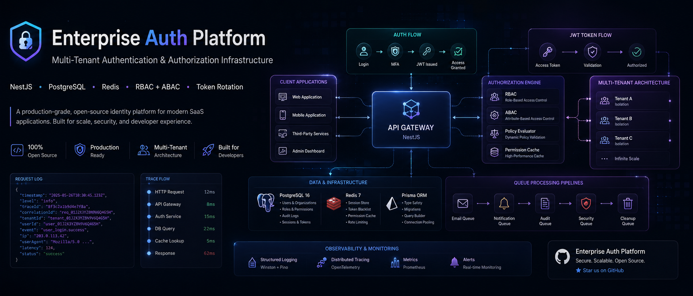

<!-- Repository cover image — replace assets/cover.png with your own banner -->
<p align="center">
  
</p>

# enterprise-auth-platform

Enterprise-grade authentication and authorization platform built on NestJS, PostgreSQL, Redis, BullMQ, and Pino.

<!-- Repository badges -->
[](LICENSE)
[](https://github.com/DevOwaisAli/enterprise-auth-platform/stargazers)
[](https://github.com/DevOwaisAli/enterprise-auth-platform/network/members)
[](https://github.com/DevOwaisAli/enterprise-auth-platform/graphs/contributors)
[](https://github.com/DevOwaisAli/enterprise-auth-platform/watchers)
[](https://github.com/DevOwaisAli/enterprise-auth-platform)

[](https://github.com/DevOwaisAli/enterprise-auth-platform/issues)
[](https://github.com/DevOwaisAli/enterprise-auth-platform/pulls)
[](https://github.com/DevOwaisAli/enterprise-auth-platform/commits)
[](https://github.com/DevOwaisAli/enterprise-auth-platform)
[](https://github.com/DevOwaisAli/enterprise-auth-platform)

[](https://nestjs.com)
[](https://www.typescriptlang.org)
[](https://www.postgresql.org)
[](https://redis.io)
[](https://www.prisma.io)

Current scope: foundation + core infrastructure + core authentication + **organizations, RBAC, ABAC, tenant isolation, invitations**, plus **MFA/TOTP, OAuth2 social login (Google/GitHub/Microsoft), and SAML SSO with JIT provisioning** — see the [roadmap](#roadmap).

## Quick start

```bash
git clone <this-repo> && cd enterprise-auth-platform
copy .env.example .env           # macOS/Linux: cp

docker compose up -d postgres redis
npm install
npm run db:generate
npm run db:migrate
npm run db:seed
npm run start:dev
```

URLs:

- API: <http://localhost:3000/api/v1>
- Swagger: <http://localhost:3000/api/docs>
- Health: <http://localhost:3000/health>

## Tech stack

| Concern         | Choice                                                          |
| --------------- | --------------------------------------------------------------- |
| Runtime         | Node.js 22 (LTS) + TypeScript 5 (strict)                        |
| Framework       | NestJS 11                                                       |
| Database        | PostgreSQL 16 via Prisma 6 (UUID v7 primary keys)               |
| Cache / KV      | Redis 7 via ioredis 5                                           |
| Queue           | BullMQ (Redis-backed)                                           |
| Mail            | Nodemailer 6 (queue-backed dispatch)                            |
| Logging         | Pino + nestjs-pino (JSON in prod, pretty in dev)                |
| Auth            | passport-jwt, bcrypt, refresh-token rotation with family detection |
| Rate limiting   | @nestjs/throttler (config-driven)                               |
| Validation      | class-validator, class-transformer, Joi (env)                   |
| API docs        | OpenAPI / Swagger at `/api/docs`                                |
| Quality         | ESLint 9 flat, Prettier 3, Husky 9, lint-staged, tsc-alias      |
| Infra           | Docker + docker-compose (app, postgres, redis)                  |

## Architecture at a glance

```
src/
├── common/          # Cross-cutting: filters, interceptors, middleware, decorators, guards, types
├── config/          # @nestjs/config + Joi validation per concern
├── infrastructure/  # Database, Redis, Cache, Queue, Mail, Logger
├── modules/
│   ├── audit/         # AuditService → audit BullMQ queue
│   ├── auth/          # Register, login, JWT, refresh rotation, sessions, password flows, switch-org
│   ├── organizations/ # Organizations, memberships, invitations, tenant guard
│   ├── authorization/ # RBAC roles + permissions, ABAC policies + engine, decorators + guards
│   └── health/        # GET /health (memory, env, services)
├── app.module.ts
└── main.ts
```

For deeper details, see [docs/architecture.md](docs/architecture.md).

## Documentation

| Doc                                              | What's inside                                                                       |
| ------------------------------------------------ | ----------------------------------------------------------------------------------- |
| [docs/architecture.md](docs/architecture.md)     | Layers, request lifecycle, response envelope, error model, AsyncLocalStorage, audit |
| [docs/configuration.md](docs/configuration.md)   | Every env var, default, validation rule                                             |
| [docs/auth.md](docs/auth.md)                     | Auth module: endpoints, password policy, JWT, refresh-token rotation, sessions      |
| [docs/authorization.md](docs/authorization.md)   | RBAC + ABAC engine, policies, decorators, guards, tenant isolation, caching          |
| [docs/infrastructure.md](docs/infrastructure.md) | Pino logger, cache abstraction, BullMQ queues, Nodemailer + templates, Prisma       |
| [docs/operations.md](docs/operations.md)         | Docker workflow, npm scripts, deployment, troubleshooting                           |

## Roadmap

- [x] User profile + organization domain models
- [x] RBAC (Role / Permission)
- [x] ABAC policy engine (resource/attribute conditions)
- [x] Multi-tenancy + tenant-scoped JWTs
- [x] Organization invitations
- [ ] MFA (TOTP, recovery codes)
- [ ] OAuth2 / OIDC providers
- [ ] SAML SSO
- [ ] Audit persistence + admin dashboards
- [ ] OpenTelemetry tracing + metrics

## License

MIT — see [LICENSE](LICENSE). Free to use, modify, and distribute; just keep the copyright notice.
